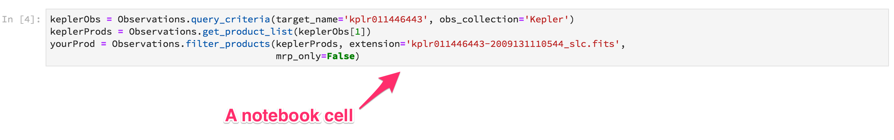
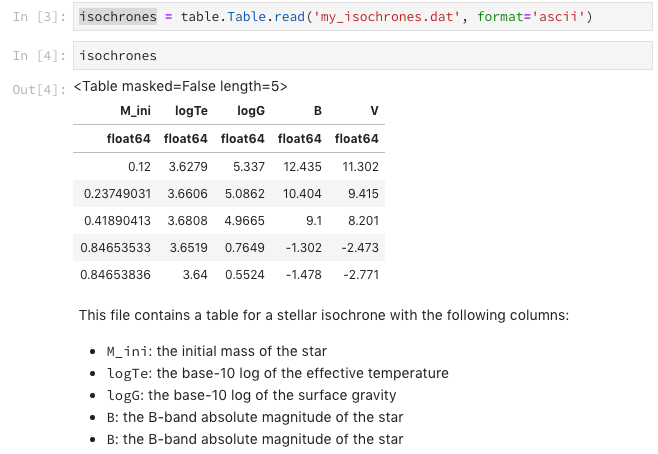

# Jupyter Notebooks

Jupyter Notebooks are a convenient format for creating and sharing documents that combine code, data analyses, vizualizations, and prose. This guide describes best practices for creating readable (easy to understand), portable (likely to work on many computers) notebooks. Following this guide is a requirement for those authors contributing content to the [STScI notebooks repository](https://github.com/spacetelescope/notebooks).

## Design principles

### Make no assumptions

As the notebook author, don't assume people know the same things as you. This means any terms/common acronyms should be defined when they are first used. It you're using some kind of astronomical parameter, make sure you define it (e.g. in its mathematical form) or link to any definitions (literature/Wikipedia etc.). If you think this is making your notebook too detailed, use clearly-named sections with appropriate introductions, or split your notebook into two separate ones that reference each other.

Above all, know your audience: if you are writing a notebook only for astronomers in a specific field, you might be more terse on background.  But if so, *say so* at the beginning of your notebook, and know that most readers will not get anything from it.

### Design for portability

Notebooks should be portable, that is, they should be designed to work on multiple computers. There are a few simple steps you can take as a notebook author to increase the 'portability' of a notebook:

- Use APIs not file systems to access data. Where at all possible, use libraries such as [`astroquery.mast`](https://astroquery.readthedocs.io/en/latest/) to retrieve the data required for your notebook. Never hard-code a path to a file on e.g. a shared filesystem. See the [data guide](where-to-put-your-data.md) for more detail on how you might implement this.
- If you need specific packages installed to enable your notebook to execute, define them in a custom [`requirements.txt`](https://pip.pypa.io/en/stable/reference/pip_install/#example-requirements-file) file that can be used to install these dependencies.  Be as specific as possible: sometimes packages make backward incompatible names, so specifying a particular version of dependencies will protect against that.

### Keep good cell discipline



Creating a new notebook can take time, and in the development process, some content cells (code and prose) may become out of date/superfluous. Before commiting your work to a source repository, make sure that:

- Cells capture logical units of work. i.e. don't put all of your code in a single giant cell of logic. Try and break it out into smaller units, inter-dispersed with text explaining what you are doing.
- All of the cells are required and *in order*. i.e., you can go from the start of your notebook to the end, executing each cell. Cells should only fail if they are *meant* to, because you're illustrating the meaning of an error message or similar.
- Checked-in notebook shouldn't contain the executed cell outputs. Any results you check in take up valuable space in the notebook, making it harder to review and bloating the repository. When your notebook is checked into the [STScI notebooks repository](https://github.com/spacetelescope/notebooks), we will run [`nbconvert`](https://nbconvert.readthedocs.io/en/latest/) to execute your notebook (overriding anything already executed) and [`sphinx`](http://www.sphinx-doc.org/) to create web-hosted versions.

### Write readable prose using Markdown

Use cells with [Markdown](https://www.markdownguide.org/basic-syntax/#paragraphs-1) formatting to describe anything that isn't actually code.  Also use them either before or after code cells to describe what's happening.  When mathmatics expressions are needed, use the [Jupyter additions to markdown](https://jupyter-notebook.readthedocs.io/en/stable/notebook.html#markdown-cells), which are basically carefully-controlled LaTeX.

Only use code comments when it's a natural inline comment directly connected to that line of code.  Do **not** use code cells with comments to replace well-written prose!

## On-disk layout and ancillary/generated files

Individual notebooks should live in their own directory along side any ancillary files related to them.  For example:

```
notebooks/
|-- MyAwesomeNotebook
|    |-- my_awesome_notebook.ipynb
|    +-- object-data.csv
|    +-- result-plot.png
|    +-- requirements.txt
```

As this demonstrates, sometimes it is appropriate to include ancillary files with your notebook. Examples include small images or data files (E.g., FITS cutouts not accessible via MAST, or CSV tables). Files of any significant size (> 100 kB is a good rule of thumb) should not be included with the notebook but rather stored outside the repository and accessed via code (see [the data guide](where-to-put-your-data.md) for details on how to do this). As shown above, if your notebook needs ancillary files, you should include them at the same level as your notebook.

Similarly, if your notebook involves *writing* files, you should write the notebook so that they are written in the same location.  E.g. if you are making a scatter plot using matplotlib and want to demonstrate to the user how to save it, you can do this in the notebook:
```
plt.scatter(...)
plt.savefig('result-plot.png')
```
and the image will end up in the same place as any ancillary files.

## Recommended notebook structure

It's recommended that Jupyter notebooks use the following suggested structure:

- [Title](#title)
- [Imports](#imports)
- [Introduction](#introduction)
- [Loading data](#loading-data)
- [File information](#file-information)
- [Sections](#sections) (xN)
- [Exercises](#exercises) (optional)
- [Additional resources](#additional-resources) (optional)
- [About this notebook](#about-this-notebook)
- [Footer](#footer)

### Title

Pick a clear, descriptive title. For titles, use the [following Markdown syntax](https://www.markdownguide.org/basic-syntax/#headings):

```
# My clear, descriptive title
```
### Imports

Import your dependencies near the top of the notebook, explaining why you're including each one. For example:


### Introduction

Write a short introduction explaining the purpose of the notebook. Link to any background materials/resources that may be useful to the reader to provide additional context.

#### Defining terms

Be sure to define any terms/common acronyms at the end of your introduction that your audience may not know. If you're using some kind of domain-specific astronomical symbol or unusual mathematical concept, make sure you define it (e.g. in its mathematical form) and link to any definitions (literature/Wikipedia etc.).

### Loading data

If the user needs to download data to run the tutorial properly, where possible, use [Astroquery]((https://astroquery.readthedocs.io/en/latest/)) (or similar) to retrieve files. If this is not
possible, see the [data guide](where-to-put-your-data.md) for other options.

### File information

Explain pertinent details about the file you've just downloaded. For example, if working with Kepler lightcurves, explain what's in the different file extensions:

```
- No. 0 (Primary): This HDU contains meta-data related to the entire file.
- No. 1 (Light curve): This HDU contains a binary table that holds data like flux measurements and times. We will extract information from here when we define the parameters for the light curve plot.
- No. 2 (Aperture): This HDU contains the image extension with data collected from the aperture. We will also use this to display a bitmask plot that visually represents the optimal aperture used to create the SAP_FLUX column in HDU1.

```

Where possible (if the code supports it): use code examples that use Jupyter to *show* what's in the data.  For example, if you are showing an object that can be read as an Astropy table, display the table:



### Sections

The meat of your notebook should be sub-divided into sections with useful names to whatever extent makes sense base on the content. Break sections up with standard [Markdown syntax headings]((https://www.markdownguide.org/basic-syntax/#headings)):

```
## Section 1

Intro to section 1

### Sub-section 1a

More detailed info about Section 1

## Section 2

A complete thought that's as important as section 1 but doesn't need sub-sections.
```

Be sure to use section headings (i.e., the number of `#`'s) in a way that gives heirarchical meaning to your document.  The header levels are used to do things like intelligently make links, so you don't want to confuse them by using heder levels that don't match the logical flow of the document.

### Exercises

Most notebooks are trying to convey *some* information to their reader.  It's often a good idea, if possible, to include in the notebook something where there is *not* an included answer so that the reader can cement in their mind how whatever it is they were supposed to learn from that notebook. If you do have exercise(s), be sure to leave a blank code cell underneath to show the user that it's meant for them to try it out right there.  You may also want to include a "solutions" notebook next to your main notebook for the user to look at after they have finished their attempt.

### Additional resources

While this isn't always necessary, sometimes you want to Provide some more resources for the reader who wants to learn something beyond what's in the notebook.  Sometimes these don't exist, but if they do, it's good to put them at the end to give the reader somewhere else to go. Usually a list of links using markdown bullet-plus-link format is approopriate:
```
* [A neat resource to learn more](http://learning.org/how-i-learned-science-is-cool.html)
* [A place to find more relevant code](https://github.com/spacetelescope/jwst)
```

### About this notebook

Let the world know who the author of this great notebook is! If possible/appropriate, include a contact email address for users who might need support (e.g. `archive@stsci.edu`)

### Footer

Notebooks should use the standard STScI footer:


## Further reading

### Example notebooks following this style guide

Here are some example notebooks that follow this style guide:

- [Kepler Full Frame Images (FFI)](https://github.com/spacetelescope/notebooks/blob/master/MAST/Kepler/Kepler_FFI/kepler_ffi.ipynb)
- [Kepler Lightcurves](https://github.com/spacetelescope/notebooks/blob/master/MAST/Kepler/Kepler_Lightcurve/kepler_lightcurve.ipynb)
- [Kepler Target Pixel Files (TPF)](https://github.com/spacetelescope/notebooks/blob/master/MAST/Kepler/Kepler_FFI/kepler_ffi.ipynb)

### Other Resources

For a related view of notebook styles in the astronomy context, see the [Astropy tutorials notebook contributing guide](https://astropy-tutorials.readthedocs.io/en/latest/contributing.html#contributing-page)

### Contributing to the STScI notebooks repository

View the contributing guide in the [STScI notebooks repository](https://github.com/spacetelescope/notebooks).
